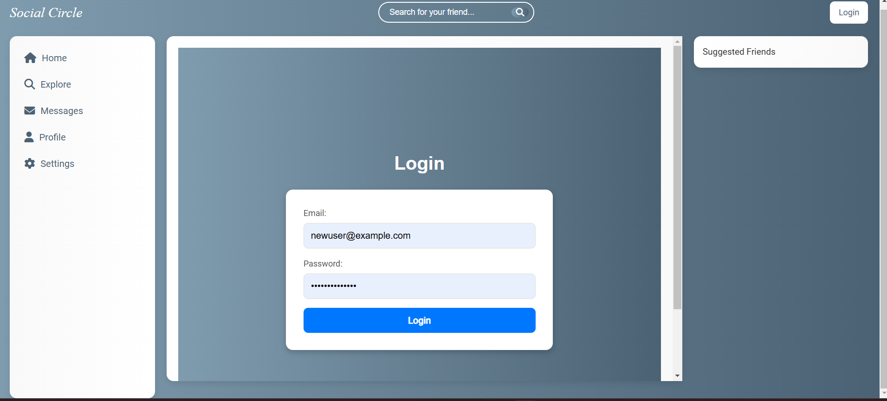
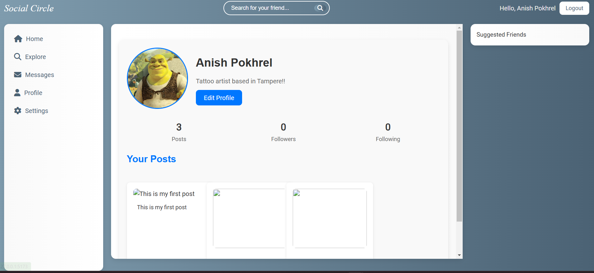
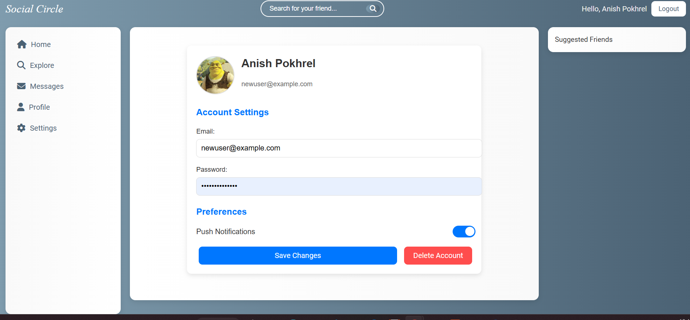

Sure, here's your README.md formatted content:

```markdown
# Social Circle - MERN Stack Social Media App

Social Circle is a full-stack web application built using the MERN stack (MongoDB, Express.js, React, and Node.js). This project serves as a learning endeavor for full-stack development and includes features such as user authentication, post creation, and profile management.

All rights belong to Krisha Karki.

## Table of Contents
- Overview
- Screenshots
- Features
- Technologies Used
- How to Run the Project
- Database Setup
- Contributing
- License

## Overview
This project enables users to:
- Register and log in to their accounts using secure authentication.
- Create, upload, and view posts on a feed.
- Edit their profiles, including uploading profile pictures.
- Manage settings for their accounts.

## Screenshots
- Login Page
  

- Feed/Home Page
  

- Message Page

- Explore Page

- User Profile
  

- Profile Settings
  


## Features
- **User Authentication**: Secure login and registration using JWT.
- **Profile Management**: Users can view and edit their profile, including uploading a profile picture.
- **Post Creation**: Users can create, upload, and view posts (images or text) on their feed.
- **Responsive Design**: The app is fully responsive and works on all devices.

## Technologies Used
- **Frontend**: React.js (with Vite for development)
- **Backend**: Node.js with Express.js
- **Database**: MongoDB (hosted locally or remotely on MongoDB Atlas)
- **Authentication**: JWT (JSON Web Token)
- **File Uploads**: Multer for handling image uploads

## How to Run the Project

### Prerequisites
Ensure that you have the following installed:
- Node.js
- MongoDB
- Git

### Steps to Run Locally

#### Clone the Repository
```bash
git clone https://github.com/krishaakarkii/social-media.git
cd social-media
```

#### Set Up the Backend
Navigate to the project root directory:
```bash
cd backend
```
Install backend dependencies:
```bash
npm install
```
Create a `.env` file in the backend folder with the following content:
```makefile
MONGO_URI=your_mongo_database_url
JWT_SECRET=your_secret_key
PORT=5000
```
Start the backend server:
```bash
npm start
```

#### Set Up the Frontend
Navigate back to the root directory:
```bash
cd ..
```
Install frontend dependencies:
```bash
npm install
```
Start the React development server:
```bash
npm run dev
```

### Access the App
Open your browser and navigate to `http://127.0.0.1:5173`.

## Database Setup
Use MongoDB Atlas (cloud-based):
1. Create a free MongoDB Atlas account at https://www.mongodb.com/atlas.
2. Set up a cluster and retrieve the connection string.
3. Replace `your_mongo_database_url` in `.env` with your Atlas connection string.

## Contributing
Contributions are welcome! Fork the repository, make changes, and submit a pull request.

## License
This project is for educational purposes only. All rights reserved by Krisha Karki.


